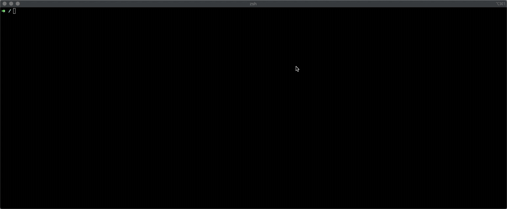

Godzilla Secret


A simple module which finds files with different secrets keys present inside a directory. Secrets derived from 120 different signatures.

## Installation

With [pipx](https://pipxproject.github.io/pipx/):

```bash
pipx install godzilla-secret
```

With Pip:

```bash
pip install godzilla-secret
```

From source:

```bash
git clone git@github.com:sobri3195/godzilla-secret.git
cd godzilla-secret
python3 -m venv .env
source .env/bin/activate
pip install .
```

## Module Usage

```bash
godzilla-secret [-h] [-c CONFIG] [-w WRITE] [-f FILTER [FILTER ...]] [-v] [-e] [-g] search_path
```



## Usage Examples

- ``godzilla-secret -c new_config.yml /home`` : Find secrets in the home directory according to the provided config file. ``config.yml`` structure provided in the next section.

- ``godzilla-secret /home -f aws microsoft crypto digitalocean ssh sql google`` : Will use the [default config](https://github.com/sobri3195/godzilla-secret/blob/master/Godzilla_secret/config.yml) and filter signatures according to those keywords.

## Module Configuration

The `config.yml` file contains the configuration for the module. All signatures derived from the config file.

```yaml
blacklisted_extensions: [] # list of extensions to ignore
blacklisted_paths: [] # list of paths to ignore
red_flag_extensions: [] # list of Extensions not be ignored
whitelisted_strings: [] # Add strings which should always be ignored
signatures: # list of signatures to check
  - part: '' # either filename, extension, path or contents
    match: '' # simple text comparison (if no regex element)
    regex: '' # regex pattern (if no match element)
    name: '' # name of the signature
```

## Contributing

- Fork this repo
- Create pull requests against the master branch
- Be sure to add tests for changes or additional functionality
- Ensure that the PR description clearly describes the behaviour of the change
- Ensure that CI tests pass

### Setup environment

```bash
python -m venv .venv
source .venv/bin/activate
pip install -r requirements-test.txt
```
#### Pre-commit

We leverage the [pre-commit](https://pre-commit.com/) framework.

Install git hooks with `pre-commit install`.

Run the checks `pre-commit run --all-files`.

## Module Inspiration

As a sysadmin, when machines are provisioned on the cloud to developers, some recklessly leave secret keys and files behind on those machines. This module helps find such leakages.


## Author

- [Muhammad Sobri Maulana](muhammadsobrimaulana31@gmail.com)

## Licence

MIT
